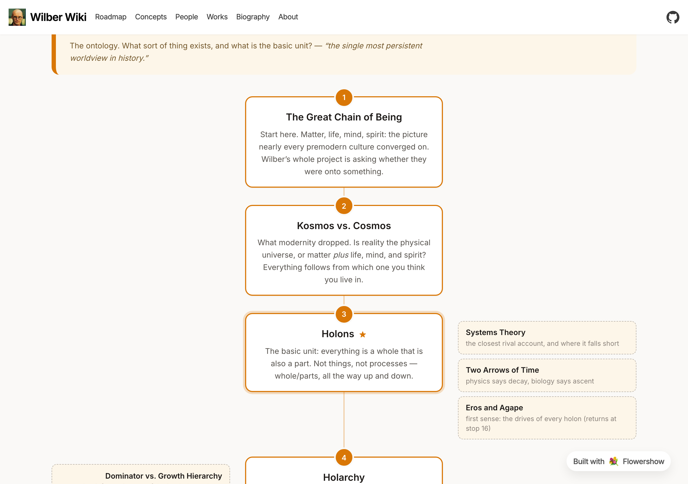
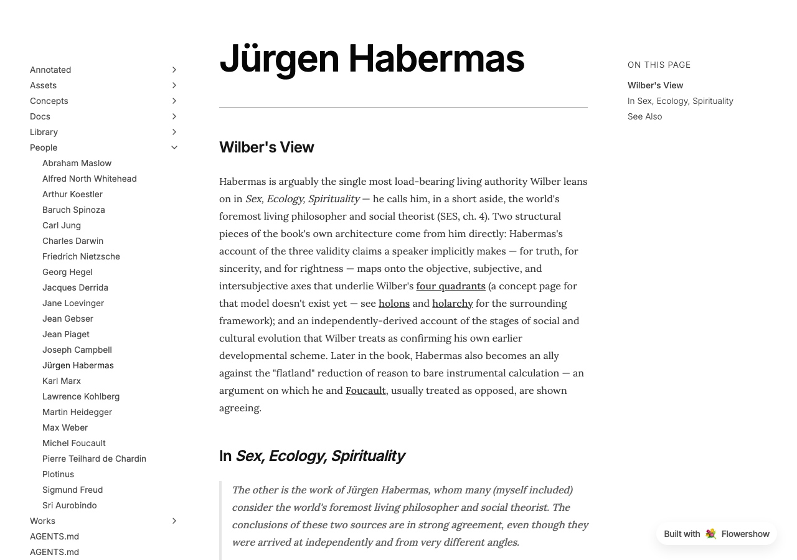
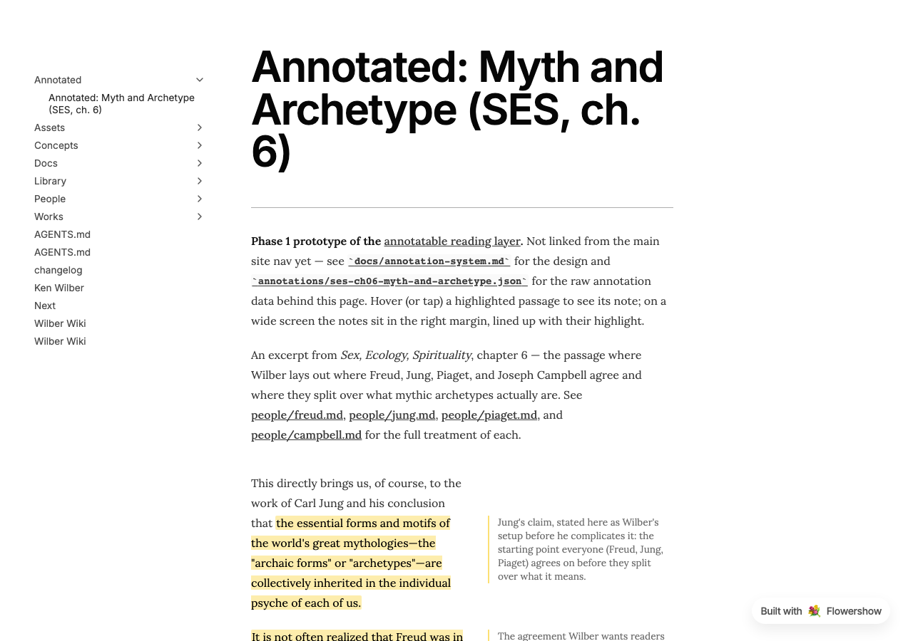
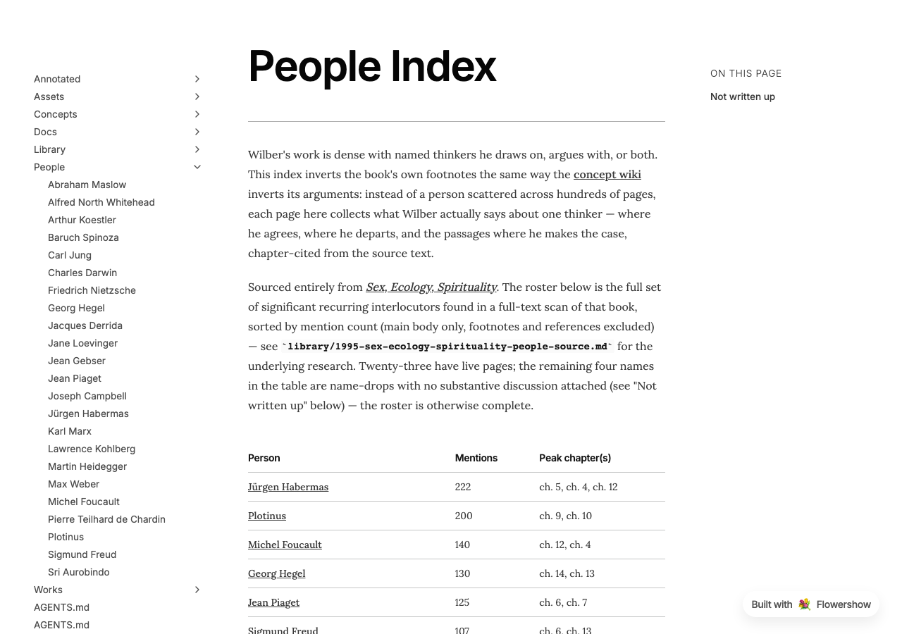
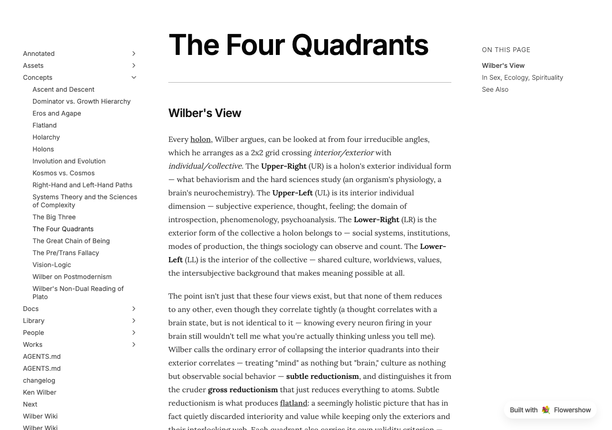

## 2026-09-14 — Choosing what to read

Added a [selective reading guide](works/reading-guide.md) and a guide to
[Wilber's five phases and the Kosmos trilogy](works/phases.md). The chronological
catalog now distinguishes retitled editions and reused material, with corrected
publication details and clearer notes where the evidence remains uncertain.

## 2026-09-03 — A roadmap through Wilber's ideas

All 41 concepts now sit on a single visual reading path: four acts, nineteen
numbered stops down a central spine, with optional side branches for depth and
counterargument. There are two ways in — start at the top if you are new, or jump
straight to a topic if you came looking for one — plus a six-stop express route for
anyone with only an afternoon, and a panel pointing at the places Wilber's argument
is most contested. See [the roadmap](roadmap.md).

## 2026-08-30 — New concept page: The Myth of Primal Ecological Wisdom

Added [The Myth of Primal Ecological Wisdom](concepts/primal-ecological-wisdom.md), on
Wilber's argument that the Eco-Romantic claim that tribal societies possessed a lost
"ecological wisdom" confuses indissociation (nature not yet differentiated from mind) with
integration, and that pre-modern peoples did real ecological damage too — limited by means,
not restrained by wisdom. Cross-linked with the pre/trans fallacy, environmental ethics,
and the dialectic of progress.

## 2026-08-23 — Excerpts now shown directly, and a full accuracy pass

The click-to-expand style used for excerpt quotes is gone — every quote across the
concept wiki and people index now shows in full, directly on the page. That prompted a
proper editorial review of all 182 excerpts against the source book, which turned up
and fixed a real problem: one page's only "quote" was actually a paraphrase, not real
text. Also fixed: a quote that broke off mid-sentence, several mislabeled chapter
citations, and a handful of pages that were more one-sided or redundant than the book
itself is. See [Jürgen Habermas](people/habermas.md) for the clearest before/after.

## 2026-08-23 — Annotatable reading layer: Phase 1 prototype

A first working prototype of annotated book text: an excerpt of *Sex, Ecology,
Spirituality* renders with highlighted passages and margin notes attached directly to
them, à la Google Docs comments. One chapter section for now, not yet linked from the
site's navigation — proof of the mechanism before it's built out further. See it live:
[Annotated: Myth and Archetype](annotated/ses-ch06-myth-and-archetype.md).

## 2026-08-23 — People index: 23 thinkers Wilber engages with

The people index is now substantially built out — Habermas, Plotinus, Foucault, Hegel,
Piaget, Freud, Jung, Joseph Campbell, Gebser, Spinoza, Whitehead, Marx, Aurobindo,
Kohlberg, Loevinger, Maslow, Koestler, Derrida, Heidegger, Darwin, Nietzsche, Weber, and
Teilhard de Chardin each get a page showing where Wilber agrees with them, where he
breaks from them, and the passages where he makes his case. Browse the
[People Index](people/index.md).

## 2026-08-23 — Concept wiki: ten more concepts, now sourced from the full book text

The concept wiki grows from seven pages to seventeen — the four quadrants, the Big
Three, the pre/trans fallacy, vision-logic, flatland, Kosmos vs. cosmos, Eros and Agape,
the Right-Hand and Left-Hand paths, involution and evolution, and Wilber's take on
postmodernism — all newly sourced directly from the book's full text rather than reading
notes. Example: [The Four Quadrants](concepts/four-quadrants.md).

## 2026-08-22 — Concept wiki pilot: seven concept pages sourced from *Sex, Ecology, Spirituality*

The first working piece of the concept wiki: instead of an idea Wilber discusses being
scattered across a dense book, each concept — holons, holarchy, dominator vs. growth
hierarchy, the Great Chain of Being, systems theory, ascent and descent, and his reading
of Plato — now gets its own page pairing a synthesis of his view with expandable
excerpts pulled straight from the source text. Example: [Holons](concepts/holons.md).

## 2026-08-22 — Bio, full works catalog, and cover art

Booted up the project: a draft biography of Ken Wilber, a complete works list (39
titles across five decades) with a dedicated page per book, cover art for most of them,
and in-depth overviews for the twelve core works. See the [Biography](bio.md) and
[Works Catalog](works/index.md).
